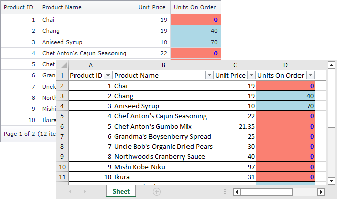

<!-- default badges list -->

[](https://supportcenter.devexpress.com/ticket/details/T262239)
[](https://docs.devexpress.com/GeneralInformation/403183)
<!-- default badges end -->
# Grid View for ASP.NET Web Forms - How to export a colored grid in Data Aware export mode
<!-- run online -->
**[[Run Online]](https://codecentral.devexpress.com/128534107/)**
<!-- run online end -->

This example shows how to color the exported grid when Data Aware export mode is used.



The grid does not export cell styles applied in the [HtmlDataCellPrepared](https://docs.devexpress.com/AspNet/DevExpress.Web.ASPxGridView.HtmlDataCellPrepared) event. 

To color the exported grid in Data Aware export mode, handle the [XlsxExportOptionsEx.CustomizeCell](https://docs.devexpress.com/CoreLibraries/DevExpress.XtraPrinting.XlsxExportOptionsEx.CustomizeCell) event.

```cs
void ExportOptions_CustomizeCell(DevExpress.Export.CustomizeCellEventArgs ea) {
	if (ea.ColumnFieldName != "UnitsOnOrder" || ea.AreaType != DevExpress.Export.SheetAreaType.DataArea) return;
	int cellValue = 0;
	if (int.TryParse(ea.Value.ToString(), out cellValue) && cellValue == 0) {
		ea.Formatting.BackColor = Color.Salmon;
		ea.Formatting.Font.Color = Color.Blue;
		ea.Formatting.Font.Bold = true;
	}
	else
		ea.Formatting.BackColor = Color.LightBlue;
	ea.Handled = true;
}
```

> **Note**  
> Starting from v15.2, the grid maintains conditional formatting styles in the exported document. You can use the [ASPxGridView.FormatConditions](https://docs.devexpress.com/AspNet/DevExpress.Web.ASPxGridView.FormatConditions) rules to define conditional formatting in browse mode and keep the applied appearance in the exported document.

## Files to Review

* [Default.aspx.cs](./CS/Default.aspx.cs#L22-L33) (VB: [Default.aspx.vb](./VB/Default.aspx.vb))
* [Default.aspx](./CS/Default.aspx) (VB: [Default.aspx](./VB/Default.aspx))

## Documentation

* [Export Grid View Data](https://docs.devexpress.com/AspNet/3791/components/grid-view/concepts/export)

## Technical Demos

* [Grid - Export with Format Conditions](https://demos.devexpress.com/ASPxGridViewDemos/Exporting/ExportWithFormatConditions.aspx)
## More Examples

* [Grid View for Web Forms - How to export a colored grid in WYSIWYG export mode](https://github.com/DevExpress-Examples/asp-net-web-forms-grid-export-colored-grid-in-wysiwyg-mode)
* [Grid View for MVC - How to export a colored grid in Data Aware export mode](https://github.com/DevExpress-Examples/asp-net-mvc-grid-export-colored-grid-in-data-aware-mode)
* [Grid View for MVC - How to export a colored grid in WYSIWYG export mode](https://github.com/DevExpress-Examples/asp-net-mvc-grid-export-colored-grid-in-wysiwyg-mode)
